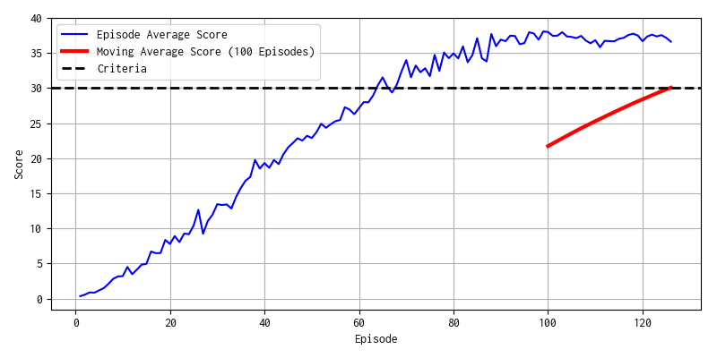

# Performance Report
## Result
Agent met criteria under 130 episodes.
You can check time series of scores in the chart below:



You can view the agent movement in the simulator
using next script:
``` bash
python view.py
```

## Agent Overview
For project of continuous control, I implemented **PPO (Proximal Policy Optimization)**
algorithm, and inside PPO, I used **GAE (Generalized Advantage Estimation)**
instead of normal advantage implementation.

As policy model, I used **Actor/Critic framework**, in which **actor** output the 
probability of actions or draw actions from the disribution based on the current state,
and **critic** output the state value function. To reduce complexity,
actor and critic shares hidden layers.

After fixed steps update of multi-agent environment, actor and critic are
mini-batch updated by PPO/GAE (synchronous updates)

## Model Detailed
Actor/Critic model shares next hidden layers:
```
Input State(33) -> Dense(512) -> LeakyReLU -> Dense(256) -> LeakyReLU*
```
After that, Actor and Critic generates each output:
```
LeakyRelu* -> Dense(4) -> tanh -> Output of Actor
LeakyReLU* -> Dense(1) -> Output of Critic
```

The output of actor model is used by mean parameter of normal distribution.
When agent plays in simulator, actor draws actions from distribution at random.
When agent updates model based on actions already drew from the model,
actor returns likelihood of actions of distribution.
(Variance parameters of normal distribution are also model parameters)

Because output of agents fluctuates based on normal distribution, agent can reach
optimal parameters in the balance between exploration and exploitation.

### Model update using PPO/GAE
**PPO** is the policy-based method derived from **TRPO (Trust Region Policy Optimization)**.
PPO calculates gradient based on policy likelihood ratio between old one and updated new one.
PPO uses clipping for likelihood ratios to prevent gradient explosion.

**GAE** is the method to calculate "generalized advantage", which balance
between TD-error and discounted sum of rewards.
In this implementations, advantage is calculated based on GAE.

## Detailed parameters
- **Discount factor gamma is set to 0.99**, and **GAE lambda 0.96.**.
- Before model update, advantage is normalized to standard normal distribution.
- **PPO clipping parameter (eps) is set to 0.1**.
- Model is updated after each **128 simulator time steps**.
- Actor/Critic are simultaneously updated using sum of loss of each model.
- Model is updated by mini-batch.
  - Optimizer is Adam. **Learning rate is 1e-4.**
  - **number of epoch is 10**
  - **mini batch size is 128**

## Future Direction
1. **Performance comparison with DDPG**  
  I only implemented PPO/GAE agent. If I have enough time, I want to
  implements DDPG agent, and compare performance with DDPG.

2. **Apply to other environments**  
  I want to apply this agent to other environments, for example openAI gym,
  and check which parameters can improve performance of agent significantly.

3. **Implement Q-Prop**  
  In Udacity lecture, Q-Prop is one of strong algorithm which improve
  PPO/GAE algorithm, so I want to implement it and check how it works and can improve performance.

